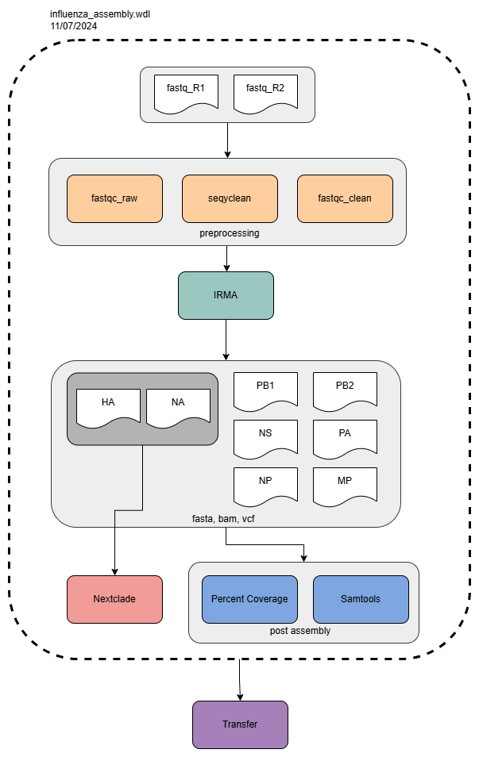

# CDPHE-influenza

<br/>

## Disclaimer
Next generation sequencing and bioinformatic and genomic analysis at CDPHE is not CLIA validated at this time. These workflows and their outputs are not to be used for diagnostic purposes and should only be used for public health action and surveillance purposes. CDPHE is not responsible for the incorrect or inappropriate use of these workflows or their results.


## Overview
This repo contains CDPHE's workflow (`influenza_assembly.wdl` & `influenza_assembly_summary.wdl`) for the whole genome assembly and anlaysis of Influenza A and B clincal specimens or grown viral isolates. This workflow is written in WDL and can be ran on the Terra.bio platform. The workflow is availabe on Dockerstore: [influenza assembly](https://dockstore.org/workflows/github.com/CDPHE-bioinformatics/CDPHE-influenza/influenza_assembly:main?tab=info) and [influenza assembly summary](https://dockstore.org/workflows/github.com/CDPHE-bioinformatics/CDPHE-influenza/influenza_assembly_summary:main?tab=info)

Sequencing data is generated using an amplicon sequencing approach with the unviersal Influenza A and universal Influenza B primers which bind to highly conserved regions at the terminal 3' and 5' ends of each gene segment. Currently this workflow only accepts 2x150 paired end Illumina read data.

Breifly our workflow accomplishes the following:

1. **Read Cleaning and Filtering.** Seqyclean is used to filter reads on quailty and lenght. Fastqc is used to generate read metrics including the number of reads.

2. **Assembly.** For assembly we use the software IRMA (Iterative Refinement Meta-Assembler) developed and written by the CDC. More information about IRMA can be found on the [CDC irma webpage](https://wonder.cdc.gov/amd/flu/irma/). Addtional details regarding IRMA can be found under the IRMA heading. 

3. **Calculate Post Assembly Metrics.** The number of reads mapped and the percent coverage of each gene segment are calculated using the bam files, consensus sequences and `READS_COUNTS.txt` file generated by IRMA.

4. **Perform Clade Assignment using Nextclade.** Assign clades to the HA and NA gene segments using Nextclade.

5. **Generate Summary Report.** The summary report combines all metrics including raw number of reads, percent coverage, mean depth, and reads mapped for each gene segment, the percent of flu mapped reads, clade assignments into a single tsv output file. 

6. **Data Transfer.** Intermediate files and outputs are transfered to Google Cloud Platform buckets. 

Numbers 1-5 and 6 occur in `influenza_assembly.wdl` and Numbers 5-6 occur in `influenza_assembly_summary.wdl`.


## INPUTS

`sample_name` : string (underscores and dashes are ok)

`project_name` : string

`fastq_R1` : file

`fastq_R2` : file

`contam_fasta`* : file (a copy of this file is in the inputs directory)

`out_bucket_path` : string

python scripts*:
    `concat_preprocess_qc_metrics_py`, 
    `irma_subtyping_results_py`,
    `calc_percent_coverage_py`,
    `concat_assemlby_qc_metrics_py`,
    `results_summary_py`,
    `caputre_version_py`,
    `capture_version_summary_py`

*These files should be added to the terra workspace data


## Outputs 

1. `{project_name}_sequencing_results.csv` column descriptions:

    `analysis_date` - the date the workflow was run

    `flu_type` - A, B, or mixed determined by IRMA

    `HA_subtype` / `NA_subtype` - For Inf A, H1-H18, and N1-N8 

    `HA_clade` / `HA_subclade` - HA clade and subclade determined by nextclade

    `NA_clade` - NA clade determined by nextclade

    `completed_segments` - number of segments assembled 

    `assembled_segments` - number of segments assembed with at least 90% coverage at 30x depth

    `filtered_reads` - the number of filtered reads based on quality and length determined by IRMA

    `mapped_reads` - the number of reads mapped(totaled across all gene segments) determined by IRMA

    `percent_mapped_reads` - mapped reads/filtered reads x 100

    `{segment}_percent_coverage`- the number of non-N bases divided by the length of the seed reference gene segment used by IRMA. The reference gene segments can be found in the IRMA files. 

    `{segment}_mean_depth` - the mean depth across the gene segment determined by using samtools

    `{segment}_mapped_reads` - the number of mapped reads to the gene segment determined by IRMA

2. Output directory stucture:
```
├── gs://{out_bucket_path}
# preprocessing
│   ├── fastqc_raw
│   │   ├── {sample_name}_R1_fastqc.html
│   │   ├── {sample_name}_R1_fastqc.zip
│   │   ├── {sample_name}_R2_fastqc.html
│   │   ├── {sample_name}_R2_fsatqc.zip
|   ├── fastqc_clean
│   │   ├── {sample_name}_R1_fastqc.html
│   │   ├── {sample_name}_R1_fastqc.zip
│   │   ├── {sample_name}_R2_fastqc.html
│   │   ├── {sample_name}_R2_fsatqc.zip
|   ├── seqyclean
│   │   ├── {sample_name}_clean_SummaryStatistics.tsv
# irma
|   ├── irma_assembly_mutlifasta
|   |   |──{sample_name}_all_assembled_segments.fasta 
|   ├── irma_assembly_results
|   |   |──{sample_name}_irma_assembled_gene_segments.csv 
|   ├── irma_alignments
|   |   |──{sample_name} 
|   |   |   |──{sample_name}_{flu_type}_{segment-subtype}.bam
|   |   |   |──{sample_name}_A_HA-H1.bam
|   |   |   |──{sample_name}_A_PB1.bam
|   ├── irma_assemblies
|   |   |──{sample_name} 
|   |   |   |──{sample_name}_{flu_type}_{segment-subtype}_irma.fasta
|   |   |   |──{sample_name}_A_HA-H1_irma.fasta 
|   |   |   |──{sample_name}_A_PB1_irma.fasta
|   ├── irma_vcfs 
|   |   |──{sample_name} 
|   |   |   |──{sample_name}_{flu_type}_{segment-subtype}.vcf
|   |   |   |──{sample_name}_A_HA-H1.vcf
|   |   |   |──{sample_name}_A_PB1.vcf
|   ├── irma_logs
|   |   |──{sample_name}_READ_COUNTS.txt 
|   |   |──{sample_name}_run_info.txt 
# post assembly
|   ├── sorted_bams
|   |   |──{sample_name} 
|   |   |   |──{sample_name}_{flu_type}_{segment-subtype}.sorted.bam
|   |   |   |──{sample_name}_A_HA-H1.sorted.bam 
|   |   |   |──{sample_name}_A_PB1.sorted.bam 
# nextclade
|   ├── nextclade_out
|   |   |──{sample_name} #repeat for each sample
|   |   |   |──{sample_name}_na_nextclade.json
|   |   |   |──{sample_name}_na_nextclade.tsv
|   |   |   |──{sample_name}_na_translation.fasta
|   |   |   |──{sample_name}_ha_nextclade.json
|   |   |   |──{sample_name}_ha_nextclade.tsv
|   |   |   |──{sample_name}_ha_HA1_translation.fasta 
|   |   |   |──{sample_name}_ha_HA2_translation.fasta
|   |   |   |──{sample_name}_ha_SigPep_translation.fasta
|   |   |   |──{sample_name}_ha_translation.fasta # only for H5
# summary results
│   ├── summary_results
|   |   ├── {project_name}_sequencing_results.csv
# version capture
│   ├── version_capture
|   |   ├── sample level version capture files (file for each sample)
|   |   |── set level version capture files

```

## IRMA
This section describes the parameters we adjusted when running IRMA and describes the outputs of key files. 

### IRMA parameters
We modify the default config file to include the following parameters:
```
MIN_CONS_SUPPORT="30" 
# Minimum allele coverage depth to call plurality consensus, otherwise calls "N". Setting this value too high can negatively impact final amended consensus.

MIN_LEN="70" 
# Minimum read length to include reads in read gathering. This value should not be greater than the typical read length. We lowered our min length because basespace performs adapter trimming which reduces the read length from the expected 2x150. 

DEL_TYPE="DEL" 
# Advanced option. If sites are completely missing during read gathering use the reference seed (REF), delete by ambiguation (NNN), or just remove (DEL). Default is old behavior: Uses "NNN" with BLAT and "DEL" otherwise. Can specify per round with space delimiter.

MIN_CONS_QUALITY="20" 
# Minimum allele average quality to call plurality consensus, otherwise calls "N". Setting this value too high can negatively impact final amended consensus.
```

### IRMA output files
The following are the  IRMA output files that we transfer as intermediate files and use for calculating sequencing metrics.

1. **Consensus Sequences** We pull the fasta files from the `amended_consensus` directory. These fasta files will have the `MIN_CONS_SUPPORT` parameter applied. We change all IUPAC ambigous bases to N and all periods to N. We remove all dashes as these represent deletions. We rename the header to e.g. `{sample_name}_A_HA-H1` or e.g. `{sample_name}_A_NP`. Note - Bases called in the fasta files in the main IRMA output directory require only 1x depth, as such these files are not transfered are used. 

2. **Bam Files** The reference file used in the bam file is the final consensus sequence. 

3. **VCF Files** The reference file used in the bam file is the final consensus sequence. 

4. **`READS_COUNTS.txt`** Located in the `tables` directory, this file contains the number of intial reads, filtered reads, mapped reads and alt mapped reads (e.g. reads that mapped to alternative flu subtype).

5. **`run_info.txt`** Located in the `logs` directory, this file lists all the assembly parameters used by IRMA, including those we adjusted.


## Workflow Diagram


