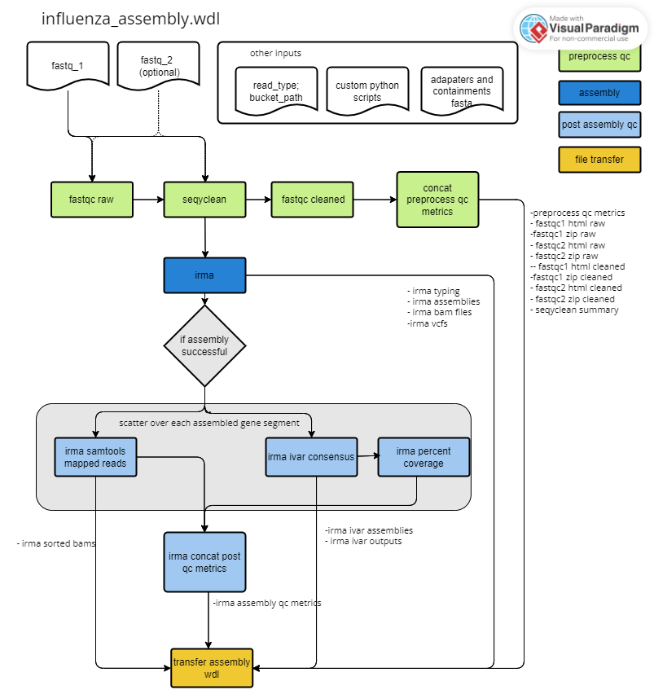

# CDPHE-influenza

<br/>

## **Table of Contents**
1. [In Development](#in-development)

2. [IRMA Overview](#irma-overview)

3. [Running on Terra](#running-on-terra)

    [1-Setting Up the Data Table](#1-setting-up-the-data-table)
    
    [2-Setting Up Workspace Data](#2-setting-up-workspace-data)

    [3-Specifying Workflow Inputs](#3-specfying-workflow-inputs)

4. [Output Directory Stucture](#output-directory-structure)

5. [Workflows](#workflows)

    [1-influenza_assembly.wdl](#1-influenza_assembly-wdl)


    [2-influenza_assembly_summary.wdl](#2-influenza_assembly_summary-wdl)

6. [Example Data](#example-data)

<br/>
<br/>

## **In Development** 
This repository is in active development. This document describes the Colorado Department of Public Health and Environment's workflow for the assembly and anlaysis of whole genome sequenicng data of influenza A and B ulitizing the Terra.bio platform. The pipeline consists of two workflows: influenza_assembly.wdl and influenza_assembly_summary.wdl. The first performs the assembly on each sample (entity = sample). The second generates a summary file that includes assembly summary statistics for all samples (entity = sample_set). Parts of the influenza_assembly.wdl workflow was adapted from and influenced by Thieagen Genomics's wf_theiacov_illumina_pe workflow for influenza. 

### **Active Development Stages**


- **Stage 1**: Baseline assembly using IRMA (Version 1.0.0 release). This will include a basic assembly pipeline that preprocesses raw fastq data from both SE and PE illumina data, generates assemblies using IRMA, generates conesensus assemblies using iVar, calculates percent coverage and mean depth for each gene segment, and generates a summary output.

- **Stage 2** (Active deveopment): Building on the baseline assembly pipeline, during this stage we will expand beyond IRMA's subtyping capability, which currently only subtypes influenza A, by incorporating subyting using abricate. This will provide a lineage for influenza B viruses. Then using the subytping information, we will perform variant calling agains the vacciine strain. 


<br/>
<br/>

## **IRMA Overview** 


Our pipeline currently uses the Iterative Refinement Meta-Assembler (IRMA) for assembly. IRMA was developed by the CDC. More information about IRMA can be found here: https://wonder.cdc.gov/amd/flu/irma/. IRMA performs genome assembly and variant calling of flu. Illumina paired-end, Illumina single-end, and ONT data can be used with IRMA. Our workflow currently supports illumina paired end and illumina single end. We use the default configuration file for the IRMA FLU module which means we use ALIGN_PROG=SAM and DEL_TYPE=''. It is also worth noting that for IRMA to attempt assembly at least 15 flu reads must map and that bases are called with at least 1 read using majority rule. (We take the bam files from IRMA and run them through ivar to generate a consensus sequence which allows for greater flexiblity and control over consensus generation parameters (e.g. min freq, min depth, min qual)).


<br/>
<br/>

## **Running on Terra**
In this section we describe how to prepare your terra workspace to run influenza_assembly.wdl followed by influenza_assembly_summary.wdl. All input for influenza_assembly_summary.wdl will be written to the terra data table during the influenza_assembly.wdl.


### **1-Setting Up the Data Table**


The datatable should look like the following and be saved as a tsv or txt file:

For PE illumina data:

| entity:sample_name   | read_type |  fastq_R1   | fastq_R2 | out_dir |
|-------------------|-----|-------------|-----------|---------------------|
| sample_name     | paired | gs://path_to_fastq_R1 | gs://path_to_fastq_R2 | gs://path_to_transfer_output

For SE illumina data:

| entity:sample_name   | read_type |  fastq_R1   | fastq_R2 | out_dir |
|-------------------|-----|-------------|-----------|---------------------|
| sample_name     | single | gs://path_to_fastq_R1 |  | gs://path_to_transfer_output


<br/>

### **2-Setting Up Workspace Data**

We have our workflow setup so that the following data files are stored in our workspace data. You can find these files in the scripts and references directory within this repo.

| Worksapce variable name | WDL variable name | File name |
| ------------------- | ----------- | ----------- |
| adapters_and_contaminants | adapters_and_contaminants | Adapters_plus_PhiX_174.fasta |
| influenza_concat_preprocess_qc_metrics_py  |concat_preprocess_qc_metrics_py | concat_preprocess_qc_metrics.py|
| influenza_calc_percent_cov_py | calc_percent_cov_py | calculate_percnet_cov.py
| influenza_concat_post_assemby_qc_metrics_py | concat_post_assembly_qc_py | concat_post_assembly_qc.py| 
| influenza_summary_py | summary_py | summary.py|

<br/>

### **3-Specifying Workflow Inputs**


Use the ``influenza_assembly_inputs_PE.json`` or ``influenza_assembly_inputs_SE.json`` template for the ``influenza_assembly.wdl`` inputs and use the ``influenza_assembly_summary_inputs.json`` for the ``influenza_assembly_summary.wdl`` located in ``./inputs/`` to see correct inputs for each workflow. There are some optional inputs for the ``influenza_assembly.wdl`` which will be in italics in the terra inputs table. Below lists these optional inputs as well as what the default is used if the input is left bank.

| task | WDL variable | default| options|
|----|----|----|---|
|fastqc_cleaned | docker| "staphb/fastqc:0.11.9" | |
|fastqc_raw |docker| "staphb/fastqc:0.11.9" | |
|irma | docker| "staphb/irma:1.0.3" | |
|irma | irma_module | "FLU" | "FLU"   |
|irma_ivar_consensus| docker | "andersenlabapps/ivar:1.3.1" | |
|seqyclean| docker | "staphb/seqyclean:1.10.09" | |


<br/>

## **Output Directory Structure**


```
├── gs://{out_dir}
│   ├── fastqc_raw
│   │   ├── {sample_name}_R1_fastqc.html
│   │   ├── {sample_name}_R1_fastqc.zip
│   │   ├── {sample_name}_R2_fastqc.html
│   │   ├── {sample_name}_R2_fsatqc.zip
|   ├── fastqc_clean
│   │   ├── {sample_name}_R1_fastqc.html
│   │   ├── {sample_name}_R1_fastqc.zip
│   │   ├── {sample_name}_R2_fastqc.html
│   │   ├── {sample_name}_R2_fsatqc.zip
|   ├── seqyclean
│   │   ├── {sample_name}_clean_SummaryStatistics.tsv
|   ├── preprocess_qc_metrics
│   │   ├── {smaple_id}_preprocess_qc_metrics.csv
|   ├── irma
│   │   ├── {sample_name} (repeat for each sample)
|   |   |   ├── {sample_name}_assembly_qc_metrics.csv
|   |   |   ├── assemblies
|   |   |   |   ├── {sample_name}_A_HA_H3.fasta
|   |   |   |   ├── {sample_name}_A_MP.fasta
|   |   |   ├── bam files
|   |   |   |   ├── {sample_name}_A_HA_H3.bam
|   |   |   |   ├── {sample_name}_A_MP.bam
|   |   |   ├── vcfs
|   |   |   |   ├── {sample_name}_A_HA_H3.vcf
|   |   |   |   ├── {sample_name}_A_MP.vcf
|   |   |   ├── sorted_bam_files
|   |   |   |   ├── {sample_name}_A_HA_H3.sorted.bam
|   |   |   |   ├── {sample_name}_A_MP.sorted.bam
|   |   |   ├── irma_ivar_consesnsus
|   |   |   |   ├── {sample_name}_A_HA_H3.fa
|   |   |   |   ├── {sample_name}_A_MP.fa
|   |   |   ├── irma_ivar_outputs
|   |   |   |   ├── {sample_name}_A_HA_H3_ivar_output.txt
|   |   |   |   ├── {sample_name}_A_MP_ivar_output.txt
│   ├── sumamry_files
|   |   ├── {project_name}_sequencing_results.csv

```


<br/>

## **Workflows**

### **1-influenza_assembly-wdl**

<br/>



<br/>

### **Summary Overview**

This workflow is run on the entity sample. The workflow can be broken down into 5 main parts. Below we describe each part.

1. **Preprocess Fastq Data**

|Task Name | Description |
|----------|-------------|
| fastqc_raw  | The quality of the raw fastq files are evaluated using fastqc. Outputs include the number of reads and the range of read lengths. |
| seqyclean| Contaiments and adapters are removed. Additionally reads are filtered based on min length. The output is cleaned fastq file. |
| fastqc_cleaned| The quality of the clenaed fastq files are evaluated using fastqc. Outputs include the number of reads and the range of read lengths. |
|concat_preprocess_qc_metrics| Using a custom python script the preprocess qc metircs from fastqc and seqyclean are summaried in a tabular formatted csv file.|

<br/>

2. **Assembly using IRMA**

|Task Name | Description |
|----------|-------------|
| irma | Runs CDC's IRMA to assemble influenza gene segements. Outputs transfered inlcude assembly files (fasta), alignment files (bam), and variant files (vcf). The influenza (A, B, C, D) type and subtype (for influenza A) is also captured from the output. The default parameters for IRMA are used. See above under IRMA overview for a description of these parameters. Output files are stored as an array.|

<br/>

3. **Consensus sequence generation using iVAR**

|Task Name | Description |
|----------|-------------|
| irma_ivar_consensus  | Generates a consensus sequence for each assembled gene segment using the bam file from IRMA (sorted using samtools sort) and iVar. Base calling is determined using a minimum read depth = 10, a minimum frequency = 0.6, and a minium quality score = 20. Output is the consensus sequence for each assembled gene segment. Runs as a scatter function over the bam files array from IRMA output. The output files are stored as an array.|

<br/>

4. **Calculate Post Assembly QC Metrics**

|Task Name | Description |
|----------|-------------|
| irma_samtools_mapped_reads| Scatters over each bam file produced form IRMA and calculates the mean depth and number of mapped reads using Samtools. The output is a tabular formatted csv file for each gene segment and the sorted bam file for each gene segmet. Outputs files are stored as an array. |
| irma_percent_coverage| Scatters over each consensus sequence produced from the irma_ivar_consensus task and using a custom python script calculates the percent coverage using the length fo the refernece seed sequnce used by IRMA.  The output is a tabular formatted csv file for each gene segment. Outputs files are stored as an array.|
| irma_concat_post_qc_metrics| Using a custom python script, generates a singular tabular formated csv file summarizing the post assembly qc metrics (coverage, depth) for each gene segment. Output is a single csv file. |

<br/>

5. **Transfer intermediate and Final Files to GCP**

|Task Name | Description |
|----------|-------------|
| transfer_assembly_wdl  | Transfers intermediate and final output files to a specified gcp bucket path. See xx for directory structure. |

<br/>


<br/>


### **Workflow Outputs**
<br/>

**Preprocessing Outputs**


|WDL Output variable name | File Name | Description |
|-------|------|------------|
| fastqc_version | N/A | version of fastqc |
| fastqc_docker | N/A | docker used for fastqc |
| fastqc1_html_raw | {sample_name}_R1_fastqc.html | |
| fastqc1_zip_raw | {sample_name}_R1_fastqc.zip| |
| fastqc2_html_raw | {sample_name}_R2_fastqc.html | empty if read_type == "single"|
| fastqc2_zip_raw | {sample_name}_R2_fastqc.zip| empty if read_type == "single"|
| fastqc1_html_cleaned | {sample_name}_R1_fastqc.html|  |
| fastqc1_zip_cleaned| {sample_name}_R1_fastqc.zip|  |
| fastqc2_html_cleaned | {sample_name}_R2_fastqc.html| empty if read_type == "single"|
| fastqc2_zip_cleaned | {sample_name}_R2_fastqc.zip| empty if read_type == "single"|
| seqyclean_version | N/A | version of seqyclean |
| seqyclean_docker | N/A | docker used for seqyclean | 
| seqyclean_summary | {sample_name}_clean_SummaryStatistics.tsv | |
| preprocess_qc_metrics| {sample_name}_preprocess_qc_metrics.csv | |

<br/>

**IRMA Assembly Outputs**

|WDL Output variable name | File Name | Description |
|-------|------|------------|
| irma_verison | N/A | version of IRMA |
| irma_docker| N/A | docker used for IRMA |
| irma_type | N/A | influenza type called by IRMA; options A, B, N/A|
| irma_ha_subtype | N/A | if influenza type == "A" then it is the influenza subtype for the HA gene called by IRMA; commonly "H1" or "H3"|
| irma_na_subtype | N/A | if influenza type == "A" then it is the influenza subtype for the NA gene called by IRMA; commonly "N1" or "N2" |
|irma_typing| {sample_name}_irma_typing.csv | csv file with the sample id, irma type, irma ha subytpe and irma na subtype listed in a tabluar format|
|irma_assemblies| {sample_name}_{flu_type}\_{gene_segment}.fasta | array of consensus assembly fasta files. Each assembled gene segment has a fasta file. The fasta header is formatted as : ">{sample_name}_{flu_type}\_{gene_segment}"|
|irma_bam_files| {sample_name}_{flu_type}\_{gene_semgnet}.bam | Array of bam files. Each assembled gene segment has a bam file. The reference sequence is the final iterative plurality consensus |
|irma_vcfs | {sample_name}_{flu_type}\_{gene_semgnet}.vcf | Array of vcf files. Each assembled gene segment has a vcf file. The reference sequence is the final iterative plurality consensus. |


 <br/>

**IRMA consensus outputs**
|WDL Output variable name | File Name | Description |
|-------|------|------------|
|irma_sorted_bams| {sample_name}_{flu_type}\_{gene_segment}.sorted.bam| Array of bam files from IRMA run through samtools sort; used for all post assembly qc metrics calucations|
|irma_ivar_assemblies| {sample_name}_{flu_type}\_{gene_segment}.fa | Array of consensus sequences generated using ``ivar consensus`` (min depth = 10 reads, min freq = 0.6, min qual = 20)|
|irma_ivar_outputs| {sample_name}_{flu_type}\_{gene_segment}_ivar_output.txt | Array of files. Screen output from ``ivar consensus`` written to file. |

 <br/>

**IRMA Post Assembly QC Metrics outputs**
|WDL Output variable name | File Name | Description |
|-------|------|------------|
|irma_bam_results| bam_results.csv| Array of bam_results files. Each assembled gene segment has a bam_results.csv file. Contains the segment name, number of reads mapped and the mean depth for that segment in a tabular format. Produced only if assembly is successful. Uses sorted bam files. |
|irma_per_cov_results| | Array of per_cov_results files. Each assembled gene segment has a per_cov_results.csv file. Contains the segment name, percent of genome covered (percent_coverage), the expected gene segmenet length (based on the seed reference segement size IRMA usees), and the assemblied gene segement length for that segment in a tabular format. Perecent coverage calculations based on the ivar consensus seqeunces generated. Produced only if assembly is successful.|
|irma_assembly_qc_metrics | {sample_name}_assebmly_qc_metrics.csv | A tablular formatted file that combines the bam_results and the perc_cov_reuslts files. Includes version and docker information for IRMA and iVar. Produced only if assembly is successful.|


<br/>

### **2-influenza_assembly_summary-wdl**
<br/> 


<br/>

### **Summary Overview**

This workflow is run on the entity sample_set. The workflow can be broken down into 2 main parts. Below we describe each part.

1. **Concatenate All Files**

|Task Name | Description |
|----------|-------------|
| summary  | concatenates teh preprocess_qc_metrics.csv, irma_typing.csv, and irma_assembly_qc_metrics.csv into a single tabular formatted file that contains all samples. Output is named {project_name}_sequencing_results.csv |


<br/>

2. **Transfer Output Files to GCP**

|Task Name | Description |
|----------|-------------|
| transfer| Transfers the summary files to the specified GCP bucket. See xx for directory structure |

<br/>

### **Workflow Outputs**

|WDL Output variable name | File Name | Description |
|-------|------|------------|
| sequencing_results_csv| {project_name}_sequencing_results.csv| |

<br/>

## **Example Data**
In development