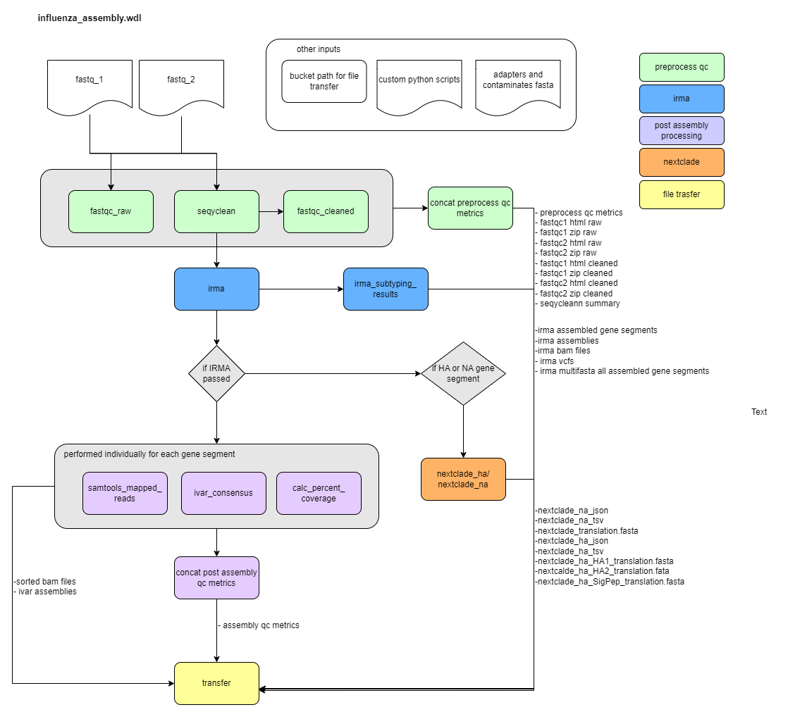
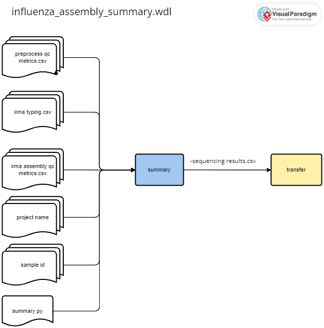

# CDPHE-influenza

<br/>

## **Table of Contents**
1. [Overview](#overview)

    [1-influenza_assembly.wdl](influenza_assembly-wdl)

    [2-influenza_assembly_summary.wdl](influenza_assembly_summary-wdl)

3. [Running on Terra](#running-on-terra)

    [1-Setting Up the Data Table](#1-setting-up-the-data-table)
    
    [2-Setting Up Workspace Data](#2-setting-up-workspace-data)

    [3-Specifying Workflow Inputs](#3-specfying-workflow-inputs)

4. [Output Directory Stucture](#output-directory-structure)

5. [Workflows](#workflows)

    [1-influenza_assembly.wdl](#1-influenza_assembly-wdl)


    [2-influenza_assembly_summary.wdl](#2-influenza_assembly_summary-wdl)

6. [Example Data](#example-data)
7. [FAQ](#FAQ)

<br/>
<br/>

## **Overview** 
This repository is in active development. This document describes the Colorado Department of Public Health and Environment's workflow for the assembly and anlaysis of whole genome sequenicng data of influenza A and B ulitizing the Terra.bio platform. The pipeline consists of two workflows: influenza_assembly.wdl and influenza_assembly_summary.wdl. The first performs the assembly on each sample (entity = sample). The second generates a summary file that includes assembly summary statistics for all samples (entity = sample_set). Parts of the influenza_assembly.wdl workflow was adapted from and influenced by Thieagen Genomics's wf_theiacov_illumina_pe workflow for influenza. Below provides a brief overview of each worklfow, for greater detail see [influenza_assembly.wdl](#1-influenza_assembly-wdl) and [influenza_assembly_summary.wdl](#2-influenza_assembly_summary-wdl).
<br/> 

### **influenza_assembly wdl**

This workflow accepts illumina paired end data. The required workflow inputs are paired end fastq files - fastq_R1 and fastq_R2, and a gcp bucket path where result files will be transfered at the completion of the workflow. Additionally, a fasta file with adapters and contaminants sequences as well as 4 custom python scripts are required. These files can be stored in your terra workspace data. 

The worklfow is divided into 5 parts:

In **part 1**, the fastq files are preprocessed. Fastqc is used to determine fastq metrics and seqyclean filters reads based on lenght and removes contaminants and adapater sequences suppled in the adaptaer and contaminants fasta file. 

In **part 2**, the software IRMA (Iterative Refinement Meta-Assembler) is run and summary results from the irma output are produced. IRMA was developed by the CDC. More information about IRMA can be found on the cdc irma webpage: https://wonder.cdc.gov/amd/flu/irma/. IRMA performs genome assembly and variant calling of flu. Illumina paired-end, Illumina single-end, and ONT data can be used with IRMA. Our workflow currently supports illumina paired end (single end has been depecated in v2.0.0). We use the default configuration file for the IRMA FLU module which means we use ALIGN_PROG=SAM and DEL_TYPE=''. It is also worth noting that for IRMA to attempt assembly at least 15 flu reads must map and that bases are called with at least 1 read using majority rule. 

For all samples that pass IRMA, which we define as IRMA calling a flu type (A or B), samples are processed through part 3 and 4. 

In **part 3**, post assembly processing occurs. First, using the bam files produced by IRMA, ivar is used to generate a second consensus sequence allowing for greater flexiblity and control over consensus generation parameters (e.g. min freq, min depth, min qual)). Currently we use a min freq of 0.5, a min depth of 25x and a min quality of 20. Follwoing ivar, we determine the percent coverage of each gene segment using the ivar consesnus assembly. Next, the number of mapped reads and mean read depth is determined using samtools. Finally, all post assemlby metrics (e.g. percent coverage, average depth, etc) are concatenated into a single csv file for each sample. 

In **part 4**, clade and subclade determination for the HA and NA gene segments are performed using Nextclade. This only occurs if the HA and/or NA gene segments were successfully assembled; otherwise no output is produced. 

In **part 5** data and results are transfered to the specified gcp bucket. (Even if IRMA failed, the preprocessing results will be transfered to the bucket). See [Output Directory Stucture](#output-directory-structure) for details about the directory stucture.

<br/>

### **influenza_assembly_summary wdl**


<br/>
<br/>


## **Running on Terra**
In this section we describe how to prepare your terra workspace to run influenza_assembly.wdl followed by influenza_assembly_summary.wdl. All input for influenza_assembly_summary.wdl will be written to the terra data table during the influenza_assembly.wdl.


### **1-Setting Up the Data Table**


The datatable should look like the following and be saved as a tsv or txt file:

For PE illumina data:

| entity:sample_name   |  fastq_R1   | fastq_R2 | out_dir |
|--------------------|-----------|-----------|---------------------|
| sample_name     | gs://path_to_fastq_R1 | gs://path_to_fastq_R2 | gs://path_to_transfer_output


<br/>

### **2-Setting Up Workspace Data**

We have our workflow setup so that the following data files are stored in our workspace data. You can find these files in the scripts and references directory within this repo.

| Worksapce variable name | WDL variable name | File name |
| ------------------- | ----------- | ----------- |
| adapters_and_contaminants | adapters_and_contaminants | Adapters_plus_PhiX_174.fasta |
| influenza_concat_preprocess_qc_metrics_py  |concat_preprocess_qc_metrics_py | concat_preprocess_qc_metrics.py|
| influenza_calc_percent_cov_py | calc_percent_cov_py | calculate_percnet_cov.py
| influenza_concat_post_assemby_qc_metrics_py | concat_post_assembly_qc_py | concat_post_assembly_qc.py| 
| influenza_irma_subtyping_results_py | irma_subtyping_results_py| irma_subtyping_results.py|
| influenza_summary_py | summary_py | summary.py|

<br/>

### **3-Specifying Workflow Inputs**


Use the ``influenza_assembly_inputs.json``  template for the ``influenza_assembly.wdl`` inputs and use the ``influenza_assembly_summary_inputs.json`` for the ``influenza_assembly_summary.wdl`` located in ``./inputs/`` to see correct inputs for each workflow. There are some optional inputs for the ``influenza_assembly.wdl`` which will be in italics in the terra inputs table. Below lists these optional inputs as well as what the default is used if the input is left bank.

| task | WDL variable | default| options|
|----|----|----|---|
|fastqc_cleaned | docker| "staphb/fastqc:0.11.9" | |
|fastqc_raw |docker| "staphb/fastqc:0.11.9" | |
|irma | docker| "staphb/irma:1.0.3" | |
|irma | irma_module | "FLU" | "FLU"   |
|irma_ivar_consensus| docker | "andersenlabapps/ivar:1.3.1" | |
|seqyclean| docker | "staphb/seqyclean:1.10.09" | |


<br/>

## **Output Directory Structure**


```
├── gs://{out_dir}
│   ├── fastqc_raw
│   │   ├── {sample_name}_R1_fastqc.html
│   │   ├── {sample_name}_R1_fastqc.zip
│   │   ├── {sample_name}_R2_fastqc.html
│   │   ├── {sample_name}_R2_fsatqc.zip
|   ├── fastqc_clean
│   │   ├── {sample_name}_R1_fastqc.html
│   │   ├── {sample_name}_R1_fastqc.zip
│   │   ├── {sample_name}_R2_fastqc.html
│   │   ├── {sample_name}_R2_fsatqc.zip
|   ├── seqyclean
│   │   ├── {sample_name}_clean_SummaryStatistics.tsv
|   ├── preprocess_qc_metrics
│   │   ├── {smaple_id}_preprocess_qc_metrics.csv
|   ├── irma_assembly_mutlifasta
|   |   |──{sample_name}_all_assembled_segments.fasta #repeat for each sample
|   ├── irma_assembly_results
|   |   |──{sample_name}_irma_assembled_gene_segments.csv #repeat for each sample
|   ├── irma_alignments
|   |   |──{sample_name} #repeat for each sample
|   |   |   |──{sample_name}_HA.bam
|   |   |   |──{sample_name}_PB1.bam
|   ├── irma_assemblies
|   |   |──{sample_name} #repeat for each sample
|   |   |   |──{sample_name}_HA_irma.fasta # header has full type/subtype description (e.g. A_HA_H3)
|   |   |   |──{sample_name}_PB1_irma.fasta # header has full type/subtype description (e.g. A_PB1)
|   ├── irma_vcfs 
|   |   |──{sample_name} #repeat for each sample
|   |   |   |──{sample_name}_HA.vcf
|   |   |   |──{sample_name}_PB1.vcf
|   ├── ivar_assemblies
|   |   |──{sample_name} #repeat for each sample
|   |   |   |──{sample_name}_HA.fa # header has full type/subtype description (e.g. A_HA_H3)
|   |   |   |──{sample_name}_PB1.fa # header has full type/subtype description (e.g. A_PB1)
|   ├── ivar_assembly_mutlifasta
|   |   |──{sample_name}_ivar.fasta #repeat for each sample
|   ├── assembly_qc_metrics
|   |   |──{sample_name}_qc_metrics.csv #repeat for each sample
|   ├── sorted_bams
|   |   |──{sample_name} #repeat for each sample
|   |   |   |──{sample_name}_HA.sorted.bam 
|   |   |   |──{sample_name}_PB1.sorted.bam 
|   ├── nextclade_out
|   |   |──{sample_name} #repeat for each sample
|   |   |   |──{sample_name}_na_nextclade.json
|   |   |   |──{sample_name}_na_nextclade.tsv
|   |   |   |──{sample_name}_na_translation.fasta
|   |   |   |──{sample_name}_ha_nextclade.json
|   |   |   |──{sample_name}_ha_nextclade.tsv
|   |   |   |──{sample_name}_ha_HA1_translation.fasta
|   |   |   |──{sample_name}_ha_HA2_translation.fasta
|   |   |   |──{sample_name}_ha_SigPep_translation.fasta
│   ├── sumamry_files
|   |   ├── {project_name}_sequencing_results.csv

```


<br/>

## **Workflows**

### **1-influenza_assembly-wdl**

<br/>



<br/>

### **Summary Overview**

This workflow is run on the entity sample. The workflow can be broken down into 5 main parts. Below we describe each part.

1. **Preprocess Fastq Data**

|Task Name | Description |
|----------|-------------|
| fastqc_raw  | The quality of the raw fastq files are evaluated using fastqc. Outputs include the number of reads and the range of read lengths. |
| seqyclean| Contaiments and adapters are removed. Additionally reads are filtered based on min length. The output is cleaned fastq file. |
| fastqc_cleaned| The quality of the clenaed fastq files are evaluated using fastqc. Outputs include the number of reads and the range of read lengths. |
|concat_preprocess_qc_metrics| Using a custom python script the preprocess qc metircs from fastqc and seqyclean are summaried in a tabular formatted csv file.|

<br/>

2. **Assembly using IRMA**

|Task Name | Description |
|----------|-------------|
| irma | Runs CDC's IRMA to assemble influenza gene segements. Outputs transfered inlcude assembly files (fasta, renamed as {sample_name}_{gene_segment}_irma.fasta (e.g. 45653456_HA_irma.fasta)), alignment files (bam, renamed as {sample_name}_{gene_segment}.bam (e.g. 4568987_HA.bam)), and variant files (vcfrenamed as {sample_name}_{gene_segment}.vcf (e.g. 4568987_HA.vcf)). The influenza type (A, B) and subtype (e.g. H1, H3, N1, N2 for influenza A) is also captured from the output. The default parameters for IRMA are used. See above under [Overview](#overview) for a description of these parameters. |
|irma_subtying_results| This task uses a python script to format the irma typing and subtyping results in a tabular form.|

<br/>

3. **Post Assembly Processing**

These tasks are performed individaully on each successfully assembled gene segment. Concat_post_qc_metrics concatenates the results for each individual gene segment into a single file.

|Task Name | Description |
|----------|-------------|
| ivar_consensus  | Generates a consensus sequence for each assembled gene segment using the bam file from IRMA (sorted using samtools sort) and iVar. Base calling is determined using a minimum read depth = 10, a minimum frequency = 0.6, and a minium quality score = 20. Output is the consensus sequence for each assembled gene segment. |
| samtools_mapped_reads| calculates the mean depth and number of mapped reads using Samtools. The output is a tabular formatted csv file for each gene segment and the sorted bam file for each gene segmet.  |
| calc_percent_coverage| Using a custom python script, calculates the percent coverage using the length of the refernece seed sequnce used by IRMA.  The output is a tabular formatted csv file for each gene segment. |
| concat_post_qc_metrics| Using a custom python script, generates a singular tabular formated csv file summarizing the post assembly qc metrics (coverage, depth) for each gene segment. Output is a single csv file. |

<br/>

4. **Nextclade**

Performed only if the HA and/or NA gene segment was successfully assembled.

|Task Name | Description |
|----------|-------------|
| nextclade_ha| Runs nextclade on the ha gene segment. Determine the nextclade dataset to use based on the type and subtype determined by IRMA. All B types are assumed to be B-vic lineage. Outputs json, tsv and translation sequences. |
| nextclade_na| Runs nextclade on the na gene segment. Determine the nextclade dataset to use based on the type and subtype determined by IRMA. All B types are assumed to be B-vic lineage. Outputs json, tsv and translation sequences. |


<br/>

5. **Transfer intermediate and Final Files to GCP**

|Task Name | Description |
|----------|-------------|
| transfer  | Transfers intermediate and final output files to a specified gcp bucket path. See [Output Directory Stucture](#output-directory-structure) for directory structure. |

<br/>


<br/>


### **Workflow Outputs**
<br/>

**Preprocessing Outputs**


|WDL Output variable name | File Name | Description |
|-------|------|------------|
| fastqc_version | N/A | version of fastqc |
| fastqc_docker | N/A | docker used for fastqc |
| fastqc1_html_raw | {sample_name}_R1_fastqc.html | |
| fastqc1_zip_raw | {sample_name}_R1_fastqc.zip| |
| fastqc2_html_raw | {sample_name}_R2_fastqc.html | |
| fastqc2_zip_raw | {sample_name}_R2_fastqc.zip| |
| fastqc1_html_cleaned | {sample_name}_R1_fastqc.html|  |
| fastqc1_zip_cleaned| {sample_name}_R1_fastqc.zip|  |
| fastqc2_html_cleaned | {sample_name}_R2_fastqc.html| |
| fastqc2_zip_cleaned | {sample_name}_R2_fastqc.zip| |
| seqyclean_version | N/A | version of seqyclean |
| seqyclean_docker | N/A | docker used for seqyclean | 
| seqyclean_summary | {sample_name}_clean_SummaryStatistics.tsv | |
| preprocess_qc_metrics| {sample_name}_preprocess_qc_metrics.csv | |

<br/>

**IRMA Assembly Outputs**

|WDL Output variable name | File Name | Description |
|-------|------|------------|
| irma_verison | N/A | version of IRMA |
| irma_docker| N/A | docker used for IRMA |
| irma_type | N/A | influenza type called by IRMA; options A, B, N/A|
| irma_ha_subtype | N/A | if influenza type == "A" then it is the influenza subtype for the HA gene called by IRMA; commonly "H1" or "H3"|
| irma_na_subtype | N/A | if influenza type == "A" then it is the influenza subtype for the NA gene called by IRMA; commonly "N1" or "N2" |
|irma_typing| {sample_name}_irma_typing.csv | csv file with the sample id, irma type, irma ha subytpe and irma na subtype listed in a tabluar format|
|irma_assmbled_gene_segments_csv | {sample_name}_irma_assembled_gene_segments.csv | csv file with the each assembled gene segment listed along with the type and (if applicable) the subtype of that that gene segment.| 
|irma_all_assembled_segments_fasta| {sample_name}.fasta| multifasta will all assembled gene segments included|
|irma_fasta_array_out| {sample_name}_{gene_segment}_irma.fasta (e.g. 24000000_HA_irma.fasta) | array of consensus assembly fasta files. Each assembled gene segment has a fasta file. The fasta header is formatted as : ">{sample_name}_{flu_type}\_{gene_segment}"|
|irma_bam_array_out_| {sample_name}_{gene_semgnet}.bam (e.g. 24000000_HA.bam) | Array of bam files. Each assembled gene segment has a bam file. The reference sequence is the final iterative plurality consensus |
|irma_vcf_array_out | {sample_name}_{gene_semgnet}.vcf (e.g 24000000_HA.vcf) | Array of vcf files. Each assembled gene segment has a vcf file. The reference sequence is the final iterative plurality consensus. |


 <br/>

**Post Assembly Processing Outputs**
|WDL Output variable name | File Name | Description |
|-------|------|------------|
|sorted_bam_array_out| {sample_name}_{gene_segment}.sorted.bam| Array of bam files from IRMA run through samtools sort; used for all post assembly qc metrics calucations|
|ivar_fasta_array_out| {sample_name}_{gene_segment}.fa (e.g. 24000000_HA.fa) | Array of consensus sequences generated using ``ivar consensus`` (min depth = 10 reads, min freq = 0.6, min qual = 20). The fasta header is formatted as : ">{sample_name}_{flu_type}_{gene_segment}" (e.g. 24000000_A_HA_H3)|
|percent_coverage_csv_array_out| percent_coverage_results.csv| Array of percent_coverage_results files. Each assembled gene segment has a per_cov_results.csv file. Contains the segment name, percent of genome covered (percent_coverage), the expected gene segmenet length (based on the seed reference segement size IRMA usees), and the assemblied gene segement length for that segment in a tabular format. Perecent coverage calculations based on the ivar consensus seqeunces generated. Produced only if assembly is successful.|
|assembly_qc_metrics| {sample_name}_assebmly_qc_metrics.csv | A tablular formatted file that combines the bam_results and the perc_cov_reuslts files. Includes version and docker information for IRMA and iVar. Produced only if assembly is successful.|

 <br/>


**Nextclade Outputs**
|WDL Output variable name | File Name | Description |
|-------|------|------------|
|na_nextclade_json| {sample_name}_na_nextclade.json||
|na_nextclade_tsv| {sample_name}_na_nextclade.tsv||
|na_translation_fasta| |{sample_name}_nextclade_na_translation.fasta||
|ha_nextclade_json| {sample_name}_ha_nextclade.json||
|ha_nextclade_tsv| {sample_name}_ha_nextclade.tsv||
|ha_HA1_translation_fasta| {sample_name}_nextclade_ha_HA1_translation.fasta||
|ha_HA2_translation_fasta| {sample_name}_nextclade_ha_HA2_translation.fasta ||
|ha_SigPep_nextclade_translation_fasta| {sample_name}_nextclade_ha_SigPep_translation.fasta||

 <br/>


**Transfer Outputs**
|WDL Output variable name | File Name | Description |
|-------|------|------------|
|transfer_date| | date the files were transfered|


<br/>

### **2-influenza_assembly_summary-wdl**
<br/> 



<br/>

### **Summary Overview**

This workflow is run on the entity sample_set. The workflow can be broken down into 2 main parts. Below we describe each part.

1. **Concatenate All Files**

|Task Name | Description |
|----------|-------------|
| summary  | concatenates teh preprocess_qc_metrics.csv, irma_typing.csv, and irma_assembly_qc_metrics.csv into a single tabular formatted file that contains all samples. Output is named {project_name}_sequencing_results.csv |


<br/>

2. **Transfer Output Files to GCP**

|Task Name | Description |
|----------|-------------|
| transfer| Transfers the summary files to the specified GCP bucket. See above for directory structure |

<br/>

### **Workflow Outputs**

|WDL Output variable name | File Name | Description |
|-------|------|------------|
| sequencing_results_csv| {project_name}_sequencing_results.csv| |

<br/>

## **Example Data**
In development

*Next generation sequencing and bioinformatic and genomic analysis at CDPHE is not CLIA validated at this time. These workflows and their outputs are not to be used for diagnostic purposes and should only be used for public health action and surveillance purposes. CDPHE is not responsible for the incorrect or inappropriate use of these workflows or their results.
